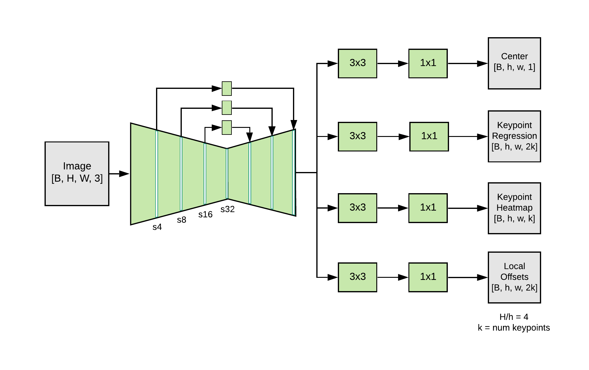

# Классификация ударов в боксе с помощью сверточных и рекуррентных нейросетей

## Введение

Задача автоматического распознавания действий в видеопотоке привлекает внимание исследователей в области технического зрения с 1980-х годов [Kautz, 1980].
Развитие возможностей вычислительных машин позволило применить алгоритмы в различных приложениях, таких как медицина, взаимодействие человека и компьютера или спорте.
В боевых искуствах для распознавания действий используется множество различных техник.
Известен подход классификации ударов с помощью акселерометров и сверточных нейронных сетей [Khasanshin, 2021].
{todo: добавить несколько примеров из https://github.com/jinwchoi/awesome-action-recognition}

Постановка задачи распознавания действий включает в себя классификацию и присвоение метки каждому из последовательности 2D-кадров, где действие может выполняться или не выполняться на протяжении всей продолжительности видео. 

X -> F -> Y
X - множество кадров видеопотока
F - извлекаемые признаки из 2D изображения
Y - множество классов действий.

Это кажется естественным расширением задач классификации изображений на несколько кадров с последующим агрегированием прогнозов из каждого кадра. 
Несмотря на стремительный успех архитектур глубокого обучения в классификации изображений (ImageNet), прогресс в архитектурах для классификации видео и обучения представлениям был более медленным.
Решение задачи извлечения ключевых точек в режиме реального времени стала возможна с появлением архитектуры MoveNet [].

## Метод исследования

Распознавание действий осуществляется в два этапа:
1. Выделение ключевых точек с помощью MoveNet.
2. Покадровая классификация с помощью сверточной или рекурентной нейросети.

### Описание MoveNet

MoveNet - это быстрая и точная модель, которая выделяет 17 ключевых точек тела. 
Обучение проводилось на двух датасетах: COCO и внутреннем наборе данных Google под названием Active.
Модель предлагается на TF Hub в двух вариантах, известных как Lightning и Thunder. 
Lightning предназначен для приложений, критичных к задержке, в то время как Thunder предназначен для приложений, требующих высокой точности. 
Обе модели работают в реальном времени (>30 fps) на современных телефонах, что имеет решающее значение для практической реализации.
Архитектура представлена на рисунке.  

Модель способна выделять ключевые точки при условии, что в кадре находится один человек.
Однако для приложения классификации ударов это ограничение является несущественным.

### Описание рекуррентной модели

### Описание сверточной модели

## Результаты экспериментов

## Заключение

## Список источников

R. Bajpai and D. Joshi, "MoveNet: A Deep Neural Network for Joint Profile Prediction Across Variable Walking Speeds and Slopes," in IEEE Transactions on Instrumentation and Measurement, vol. 70, pp. 1-11, 2021, Art no. 2508511, doi: 10.1109/TIM.2021.3073720.  

Broilovskiy A., Makarov I. (2021) Human Action Recognition for Boxing Training Simulator. In: van der Aalst W.M.P. et al. (eds) Analysis of Images, Social Networks and Texts. AIST 2020. Lecture Notes in Computer Science, vol 12602. Springer, Cham. https://doi.org/10.1007/978-3-030-72610-2_25
